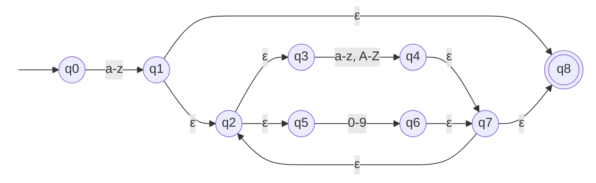
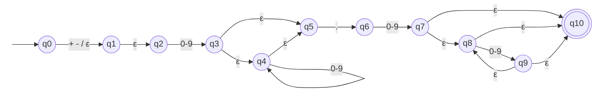
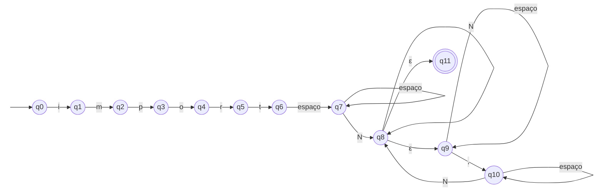
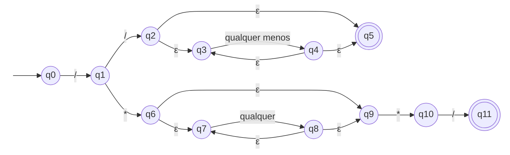

# Diagramas dos AFNε

Círculo duplo = estado final. A seta sem origem aponta para o estado inicial.

## ER-01 · Identificador camelCase

## ER-02 · Token Stripe sk_live_

```mermaid
flowchart LR
    inicio(( )) --> q0
    q0((q0))
    q1((q1))
    q2((q2))
    q3((q3))
    q4((q4))
    q5((q5))
    q6((q6))
    q7((q7))
    q8((q8))
    q9((q9))
    q10((q10))
    q11((q11))
    q12((q12))
    q13((q13))
    q14((q14))
    q15((q15))
    q16((q16))
    q17((q17))
    q18((q18))
    q19((q19))
    q20((q20))
    q21((q21))
    q22((q22))
    q23((q23))
    q24((q24))
    q25((q25))
    q26((q26))
    q27((q27))
    q28((q28))
    q29((q29))
    q30((q30))
    q31((q31))
    q32(((q32)))
    q0 -- "s" --> q1
    q1 -- "k" --> q2
    q2 -- "_" --> q3
    q3 -- "l" --> q4
    q4 -- "i" --> q5
    q5 -- "v" --> q6
    q6 -- "e" --> q7
    q7 -- "_" --> q8
    q8 -- "A" --> q9
    q9 -- "A" --> q10
    q10 -- "A" --> q11
    q11 -- "A" --> q12
    q12 -- "A" --> q13
    q13 -- "A" --> q14
    q14 -- "A" --> q15
    q15 -- "A" --> q16
    q16 -- "A" --> q17
    q17 -- "A" --> q18
    q18 -- "A" --> q19
    q19 -- "A" --> q20
    q20 -- "A" --> q21
    q21 -- "A" --> q22
    q22 -- "A" --> q23
    q23 -- "A" --> q24
    q24 -- "A" --> q25
    q25 -- "A" --> q26
    q26 -- "A" --> q27
    q27 -- "A" --> q28
    q28 -- "A" --> q29
    q29 -- "A" --> q30
    q30 -- "A" --> q31
    q31 -- "A" --> q32
    style inicio fill:none,stroke:none
```

## ER-03 · Número decimal

## ER-04 · Import Python

## ER-05 · Comentário

