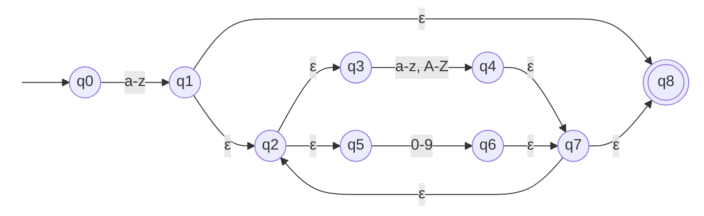

# ER-01 · Identificador camelCase

## Nome e finalidade

**Identificador camelCase.** Reconhece nomes de variáveis e funções escritos no padrão camelCase, como `totalValue` e `getHTTPResponse2`. Em um linter, serve para verificar se o código segue a convenção de nomes do projeto.

## Alfabeto

Σ = L ∪ U ∪ D, em que:

| Símbolo | Conjunto | Na `criptografia()` |
|---|---|---|
| L | letras minúsculas `{a, b, …, z}` | coluna 0 |
| U | letras maiúsculas `{A, B, …, Z}` | coluna 1 |
| D | dígitos `{0, 1, …, 9}` | coluna 2 |

Qualquer outro caractere (`_`, `-`, espaço, letras acentuadas) fica fora do alfabeto: a `criptografia()` devolve `-1` e a cadeia é rejeitada na hora.

## Linguagem reconhecida

Cadeias que **começam com uma letra minúscula** e continuam com **zero ou mais** letras (minúsculas ou maiúsculas) e dígitos. O menor identificador válido tem 1 caractere (`x`).

## Expressão Regular

**Notação formal:**

```
L · ((L ∪ U) ∪ D)*
```

com L = (a ∪ b ∪ … ∪ z), U = (A ∪ B ∪ … ∪ Z) e D = (0 ∪ 1 ∪ … ∪ 9).

**Sintaxe no código** (`src/terminal_ER/validators.py`):

```python
CAMEL_CASE_PATTERN = r"[a-z][a-zA-Z0-9]*"
```

A função usa `re.fullmatch`, que exige que a **cadeia inteira** pertença à linguagem (e não só um pedaço dela).

## Operadores utilizados

| Operador | Na notação formal | No Python | Papel nesta ER |
|---|---|---|---|
| União | `∪` | `[...]` (classe de caracteres) | `[a-z]` é `a ∪ b ∪ … ∪ z`; `[a-zA-Z0-9]` une os três conjuntos |
| Concatenação | `·` | escrever lado a lado | a primeira letra vem **seguida** do resto |
| Fecho de Kleene | `*` | `*` | o resto pode se repetir **zero ou mais** vezes |

## AFNε

Arquivo: `src/automatos/afne_er1.py`

- **Estado inicial:** q0
- **Estados finais:** {q8}
- **Estados:** 9 (q0 a q8)



**Tabela de transições** (→ = inicial, * = final, – = sem transição):

| Estado | `a-z` | `A-Z` | `0-9` | ε |
|---|---|---|---|---|
| → q0 | {q1} | – | – | – |
| q1 | – | – | – | {q2, q8} |
| q2 | – | – | – | {q3, q5} |
| q3 | {q4} | {q4} | – | – |
| q4 | – | – | – | {q7} |
| q5 | – | – | {q6} | – |
| q6 | – | – | – | {q7} |
| q7 | – | – | – | {q2, q8} |
| *q8 | – | – | – | – |

### Como o autômato foi montado

Ele segue a construção de Thompson, peça por peça da ER:

| Pedaço da ER | Estados | O que acontece |
|---|---|---|
| `L` (primeira letra) | q0 → q1 | lê obrigatoriamente uma minúscula |
| `(L ∪ U)` | q3 → q4 | um ramo da união: lê uma letra |
| `D` | q5 → q6 | o outro ramo da união: lê um dígito |
| `∪` | q2 →ε q3 e q2 →ε q5 | a bifurcação: escolhe um dos dois ramos |
| `*` | q7 →ε q2 (volta) e q1/q7 →ε q8 (sai) | repete quantas vezes quiser, inclusive nenhuma |

### Exemplo de execução: `v1`

| Passo | Lê | Estados antes (com fecho-ε) | Vai para |
|---|---|---|---|
| início | – | {q0} | – |
| 1 | `v` (L) | {q0} | {q1} |
| 2 | `1` (D) | {q1, q2, q3, q5, q8} | {q6} |
| fim | – | {q2, q3, q5, q6, q7, q8} | contém **q8** → **aceita** |

Repare no passo 2: estando em q1, o fecho-ε leva a máquina a q2, q3, q5 e q8 **ao mesmo tempo**. Só q5 sabe ler um dígito, então é por ali que ela segue.

## Casos de teste

| Cadeia | Esperado | Observação |
|---|---|---|
| `'totalValue'` | aceita |  |
| `'userName'` | aceita |  |
| `'v1'` | aceita |  |
| `'getHTTPResponse2'` | aceita |  |
| `'a1b2c3'` | aceita |  |
| `'x'` | aceita | caso-limite: menor identificador possível |
| `'2nota'` | rejeita |  |
| `'nome-completo'` | rejeita |  |
| `'User'` | rejeita |  |
| `'user_id'` | rejeita | snake_case não é camelCase |
| `'ação'` | rejeita | caso-limite: letra fora do alfabeto ASCII |
| `''` | rejeita | caso-limite: cadeia vazia |
