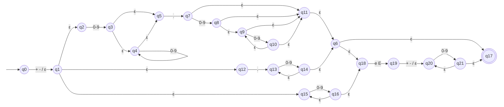

# ER-03 · Número de ponto flutuante / notação científica

## Nome e finalidade

**Número decimal ou científico.** Reconhece literais numéricos com casas decimais (`3.14`, `.5`, `3.`) ou em notação científica (`1e10`, `-3.14e+10`). Em um linter, serve para identificar valores numéricos de ponto flutuante no código e diferenciá-los de inteiros.

## Alfabeto

Σ = S ∪ D ∪ {.} ∪ E, em que:

| Símbolo | Conjunto | Na `criptografia()` |
|---|---|---|
| S | sinais `{+, -}` | coluna 0 |
| D | dígitos `{0, …, 9}` | coluna 1 |
| `.` | ponto decimal | coluna 2 |
| E | marca de expoente `{e, E}` | coluna 3 |
| ε | movimento vazio | coluna 4 |

## Linguagem reconhecida

Um sinal opcional seguido de **um de dois formatos**:

1. **Mantissa com ponto:** `dígitos.dígitos` (os da direita são opcionais, como em `3.`) ou `.dígitos` (sem parte inteira, como em `.5`). Depois pode vir um expoente opcional.
2. **Inteiro com expoente obrigatório:** `1e10`, `7E-3`.

O expoente é `e` ou `E`, um sinal opcional e pelo menos um dígito. **Inteiros puros (`42`) ficam de fora**, porque não são ponto flutuante.

## Expressão Regular

**Notação formal:**

```
(S ∪ ε) · ( (D·D*·.·D* ∪ .·D·D*) · (X ∪ ε)  ∪  D·D*·X )

onde X = E · (S ∪ ε) · D · D*
```

com S = (+ ∪ -), D = (0 ∪ 1 ∪ … ∪ 9) e E = (e ∪ E).

**Sintaxe no código** (`src/terminal_ER/validators.py`):

```python
FLOAT_SCIENTIFIC_PATTERN = r"[+-]?(([0-9]+\.[0-9]*|\.[0-9]+)([eE][+-]?[0-9]+)?|[0-9]+[eE][+-]?[0-9]+)"
```

## Operadores utilizados

| Operador | Na notação formal | No Python | Papel nesta ER |
|---|---|---|---|
| União | `∪` | `\|` e `[...]` | escolhe entre os dois formatos; `[eE]` e `[+-]` são uniões de símbolos |
| Concatenação | `·` | lado a lado | sinal, depois mantissa, depois expoente |
| Fecho de Kleene | `*` | `*` | `[0-9]*`: dígitos depois do ponto podem não existir (`3.`) |
| Fecho positivo | `D · D*` | `+` | `[0-9]+`: **pelo menos um** dígito; é atalho para `D·D*` |
| Opcional | `(x ∪ ε)` | `?` | sinal e expoente podem aparecer ou não |
| Agrupamento | `( )` | `( )` | define até onde vai cada união |
| Escape | – | `\.` | no Python, `.` sozinho significa "qualquer caractere"; `\.` é o ponto literal |

## AFNε

Arquivo: `src/automatos/afne_er3.py`

- **Estado inicial:** q0
- **Estados finais:** {q17}
- **Estados:** 22 (q0 a q21)



**Tabela de transições** (→ = inicial, * = final, – = sem transição):

| Estado | `+ -` | `0-9` | `.` | `e E` | ε |
|---|---|---|---|---|---|
| → q0 | {q1} | – | – | – | {q1} |
| q1 | – | – | – | – | {q2, q12, q15} |
| q2 | – | {q3} | – | – | – |
| q3 | – | – | – | – | {q4, q5} |
| q4 | – | {q4} | – | – | {q5} |
| q5 | – | – | {q7} | – | – |
| q6 | – | – | – | – | {q17, q18} |
| q7 | – | {q8} | – | – | {q11} |
| q8 | – | – | – | – | {q9, q11} |
| q9 | – | {q10} | – | – | {q11} |
| q10 | – | – | – | – | {q9, q11} |
| q11 | – | – | – | – | {q6} |
| q12 | – | – | {q13} | – | – |
| q13 | – | {q14} | – | – | – |
| q14 | – | – | – | – | {q6, q13} |
| q15 | – | {q16} | – | – | – |
| q16 | – | – | – | – | {q15, q18} |
| *q17 | – | – | – | – | – |
| q18 | – | – | – | {q19} | – |
| q19 | {q20} | – | – | – | {q20} |
| q20 | – | {q21} | – | – | – |
| q21 | – | – | – | – | {q17, q20} |

### Como o autômato foi montado

| Pedaço da ER | Estados | O que acontece |
|---|---|---|
| `(S ∪ ε)` | q0 → q1 | lê um sinal **ou** pula por ε |
| a união dos 3 formatos | q1 →ε q2, q12, q15 | a máquina tenta os três caminhos ao mesmo tempo |
| `D·D*·.·D*` | q2 a q11 | dígitos, ponto e dígitos opcionais (q7 →ε q11 permite `3.`) |
| `.·D·D*` | q12 a q14 | ponto e pelo menos um dígito |
| junção | q6 | a mantissa com ponto terminou: pode ir para o final (q17) ou para o expoente (q18) |
| `D·D*·X` | q15, q16 | dígitos e depois **obrigatoriamente** o expoente (q16 só tem ε para q18, nunca para q17) |
| `X = E·(S ∪ ε)·D·D*` | q18 a q21 | `e`/`E`, sinal opcional e dígitos |

### Por que `42` é rejeitado?

Depois de ler `4` e `2`, a máquina fica em {q4, q5, q15, q16, q18}. Nenhum deles é final: q5 espera um ponto e q18 espera um `e`. A cadeia acaba sem chegar a q17, então é **rejeitada**.

## Casos de teste

| Cadeia | Esperado | Observação |
|---|---|---|
| `'-3.14e+10'` | aceita |  |
| `'0.0005'` | aceita |  |
| `'1e10'` | aceita |  |
| `'+2.5E-3'` | aceita |  |
| `'.5'` | aceita | caso-limite: sem parte inteira |
| `'3.'` | aceita | caso-limite: sem casas decimais |
| `'--3.14'` | rejeita |  |
| `'3.14.15'` | rejeita |  |
| `'e10'` | rejeita |  |
| `'42'` | rejeita | caso-limite: inteiro não é ponto flutuante |
| `'.'` | rejeita | caso-limite: ponto sozinho |
| `'1e'` | rejeita | expoente sem dígitos |
| `''` | rejeita |  |
