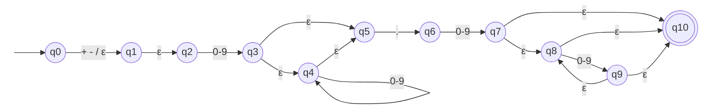

# ER-03 · Número decimal

## Nome e finalidade

**Número decimal.** Reconhece números com casas decimais e sinal opcional, como `3.14`, `-12.50` e `+0.5`. Em um linter, serve para identificar valores numéricos de ponto flutuante no código e diferenciá-los de inteiros.

## Alfabeto

Σ = S ∪ D ∪ {.}, em que:

| Símbolo | Conjunto | Na `criptografia()` |
|---|---|---|
| S | sinais `{+, -}` | coluna 0 |
| D | dígitos `{0, …, 9}` | coluna 1 |
| `.` | ponto decimal | coluna 2 |
| ε | movimento vazio | coluna 3 |

## Linguagem reconhecida

Um sinal opcional, **pelo menos um dígito**, o ponto e **pelo menos um dígito**. Inteiros (`42`), números sem parte inteira (`.5`) e números sem casas decimais (`3.`) ficam de fora.

## Expressão Regular

**Notação formal:**

```
(S ∪ ε) · D · D* · . · D · D*
```

com S = (+ ∪ -) e D = (0 ∪ 1 ∪ … ∪ 9).

**Sintaxe no código** (`src/terminal_ER/validators.py`):

```python
FLOAT_PATTERN = r"[+-]?[0-9]+\.[0-9]+"
```

## Operadores utilizados

| Operador | Na notação formal | No Python | Papel nesta ER |
|---|---|---|---|
| União | `∪` | `[...]` | `[+-]` é `+ ∪ -`; `[0-9]` é `0 ∪ 1 ∪ … ∪ 9` |
| Concatenação | `·` | lado a lado | sinal, depois dígitos, ponto e dígitos |
| Opcional | `(S ∪ ε)` | `?` | o sinal pode aparecer ou não |
| Fecho positivo | `D · D*` | `+` | `[0-9]+`: **pelo menos um** dígito; é atalho para `D·D*` |
| Escape | – | `\.` | no Python, `.` sozinho significa "qualquer caractere"; `\.` é o ponto literal |

## AFNε

Arquivo: `src/automatos/afne_er3.py`

- **Estado inicial:** q0
- **Estados finais:** {q10}
- **Estados:** 11 (q0 a q10)



**Tabela de transições** (→ = inicial, * = final, – = sem transição):

| Estado | `+ -` | `0-9` | `.` | ε |
|---|---|---|---|---|
| → q0 | {q1} | – | – | {q1} |
| q1 | – | – | – | {q2} |
| q2 | – | {q3} | – | – |
| q3 | – | – | – | {q4, q5} |
| q4 | – | {q4} | – | {q5} |
| q5 | – | – | {q6} | – |
| q6 | – | {q7} | – | – |
| q7 | – | – | – | {q8, q10} |
| q8 | – | {q9} | – | {q10} |
| q9 | – | – | – | {q8, q10} |
| *q10 | – | – | – | – |

### Como o autômato foi montado

| Pedaço da ER | Estados | O que acontece |
|---|---|---|
| `(S ∪ ε)` | q0 → q1 | lê um sinal **ou** pula por ε |
| `D · D*` | q2 a q5 | q2 → q3 lê o primeiro dígito; q4 repete os outros |
| `.` | q5 → q6 | o ponto |
| `D · D*` | q6 a q10 | q6 → q7 lê o primeiro dígito depois do ponto; q8 ↔ q9 repetem os outros |
| final | q10 | chega aqui por ε depois de ter lido pelo menos um dígito decimal |

### Exemplo de execução: `-1.5` (aceita)

| Lê | Vai para | Estados depois do fecho-ε |
|---|---|---|
| início | – | {q0, q1, q2} |
| `-` | {q1} | {q1, q2} |
| `1` | {q3} | {q3, q4, q5} |
| `.` | {q6} | {q6} |
| `5` | {q7} | {q7, q8, q10} → contém **q10**, **aceita** |

### Exemplo de execução: `42` (rejeitada)

| Lê | Vai para | Estados depois do fecho-ε |
|---|---|---|
| início | – | {q0, q1, q2} |
| `4` | {q3} | {q3, q4, q5} |
| `2` | {q4} | {q4, q5} → não contém q10, **rejeita** |

A cadeia acaba com a máquina em q5, esperando um ponto que nunca veio.

## Casos de teste

| Cadeia | Esperado | Observação |
|---|---|---|
| `'-12.50'` | aceita |  |
| `'3.14'` | aceita |  |
| `'+0.5'` | aceita |  |
| `'0.0005'` | aceita |  |
| `'1234567.89'` | aceita |  |
| `'0.0'` | aceita | caso-limite: menor decimal possível (1 dígito de cada lado) |
| `'--3.14'` | rejeita |  |
| `'3.14.15'` | rejeita |  |
| `'1e10'` | rejeita |  |
| `'42'` | rejeita | caso-limite: inteiro não é decimal |
| `'.5'` | rejeita | caso-limite: falta a parte inteira |
| `'3.'` | rejeita | caso-limite: faltam as casas decimais |
| `''` | rejeita |  |
