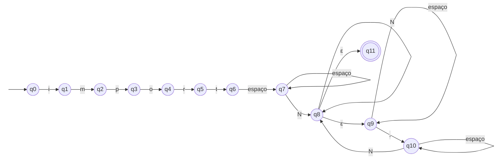

# ER-04 · Import Python

## Nome e finalidade

**Import Python.** Reconhece linhas de import do Python com um ou mais módulos, como `import math`, `import os.path` e `import os, sys`. Em um linter, serve para mapear as **dependências** de um arquivo, ou seja, quais bibliotecas ele usa.

## Alfabeto

Σ = N ∪ {espaço, vírgula}, em que N = `{a, …, z, A, …, Z, 0, …, 9, _, .}` são os caracteres de nome de módulo.

| Símbolo | Na `criptografia()` |
|---|---|
| `i`, `m`, `p`, `o`, `r`, `t` | colunas 0 a 5 (uma para cada letra de `import`) |
| outro caractere de nome | coluna 6 |
| espaço (ou tab) | coluna 7 |
| `,` | coluna 8 |
| ε | coluna 9 |

As letras de `import` têm coluna própria porque, na palavra-chave, o autômato precisa saber **qual** letra leu. No nome do módulo qualquer uma serve, então ali as colunas 0 a 6 juntas formam o conjunto N.

## Linguagem reconhecida

A palavra `import`, pelo menos um espaço e **uma lista de nomes de módulo separados por vírgula**. Pode haver espaços em volta das vírgulas. Outras formas de import (`from os import path`, imports de JavaScript) ficam de fora.

## Expressão Regular

**Notação formal:**

```
i · m · p · o · r · t · W · W* · N · N* · ( W* · , · W* · N · N* )*
```

com W = espaço e N = (a ∪ … ∪ z ∪ A ∪ … ∪ Z ∪ 0 ∪ … ∪ 9 ∪ _ ∪ .).

**Sintaxe no código** (`src/terminal_ER/validators.py`):

```python
MODULE_IMPORT_PATTERN = r"import\s+[a-zA-Z0-9_.]+(\s*,\s*[a-zA-Z0-9_.]+)*"
```

## Operadores utilizados

| Operador | Na notação formal | No Python | Papel nesta ER |
|---|---|---|---|
| Concatenação | `·` | lado a lado | `import` é a concatenação das suas 6 letras |
| União | `∪` | `[...]` | `[a-zA-Z0-9_.]` junta todos os caracteres de nome |
| Fecho positivo | `x · x*` | `+` | `\s+`: pelo menos um espaço; `[...]+`: nome com pelo menos um caractere |
| Fecho de Kleene | `*` | `*` | `\s*`: espaços opcionais em volta da vírgula; `(...)*`: quantos módulos extras quiser, inclusive nenhum |
| Agrupamento | `( )` | `( )` | o `*` do final repete o bloco inteiro "vírgula + nome" |

## AFNε

Arquivo: `src/automatos/afne_er4.py`

- **Estado inicial:** q0
- **Estados finais:** {q11}
- **Estados:** 12 (q0 a q11)



**Tabela de transições** (→ = inicial, * = final, – = sem transição; N = caractere de nome):

| Estado | `i` | `m` | `p` | `o` | `r` | `t` | `outro` | `espaço` | `,` | ε |
|---|---|---|---|---|---|---|---|---|---|---|
| → q0 | {q1} | – | – | – | – | – | – | – | – | – |
| q1 | – | {q2} | – | – | – | – | – | – | – | – |
| q2 | – | – | {q3} | – | – | – | – | – | – | – |
| q3 | – | – | – | {q4} | – | – | – | – | – | – |
| q4 | – | – | – | – | {q5} | – | – | – | – | – |
| q5 | – | – | – | – | – | {q6} | – | – | – | – |
| q6 | – | – | – | – | – | – | – | {q7} | – | – |
| q7 | {q8} | {q8} | {q8} | {q8} | {q8} | {q8} | {q8} | {q7} | – | – |
| q8 | {q8} | {q8} | {q8} | {q8} | {q8} | {q8} | {q8} | – | – | {q9, q11} |
| q9 | – | – | – | – | – | – | – | {q9} | {q10} | – |
| q10 | {q8} | {q8} | {q8} | {q8} | {q8} | {q8} | {q8} | {q10} | – | – |
| *q11 | – | – | – | – | – | – | – | – | – | – |

### Como o autômato foi montado

| Pedaço da ER | Estados | O que acontece |
|---|---|---|
| `i·m·p·o·r·t` | q0 a q6 | uma letra por estado (são os estados do AFNε original) |
| `W · W*` | q6 → q7 (e q7 repete) | pelo menos um espaço |
| `N · N*` | q7 → q8 (e q8 repete) | o nome do primeiro módulo |
| decisão | q8 →ε q9 ou q11 | acabou (q11) ou vem mais um módulo (q9) |
| `W* · , · W*` | q9 → q10 | espaços opcionais, vírgula, espaços opcionais |
| volta do `*` | q10 → q8 | lê o próximo nome e volta para a mesma decisão |

### Exemplo de execução: `import a, b` (aceita)

| Lê | Estados depois do fecho-ε |
|---|---|
| `import` (6 letras) | {q6} |
| espaço | {q7} |
| `a` | {q8, q9, q11}: aqui a cadeia **já poderia** terminar |
| `,` | {q10} |
| espaço | {q10} |
| `b` | {q8, q9, q11} → contém **q11**, **aceita** |

## Casos de teste

| Cadeia | Esperado | Observação |
|---|---|---|
| `'import math'` | aceita |  |
| `'import os.path'` | aceita |  |
| `'import os, sys'` | aceita |  |
| `'import os,sys,json'` | aceita |  |
| `'import numpy_v2'` | aceita |  |
| `'import a'` | aceita | caso-limite: módulo de 1 caractere |
| `'import'` | rejeita |  |
| `"require('fs')"` | rejeita |  |
| `'from os import path'` | rejeita | outra forma de import, fora desta linguagem |
| `'include <stdio.h>'` | rejeita |  |
| `'import os,'` | rejeita | caso-limite: vírgula sem o próximo módulo |
| `'import os sys'` | rejeita | módulos sem vírgula |
| `'imports math'` | rejeita | palavra-chave errada |
| `''` | rejeita |  |
