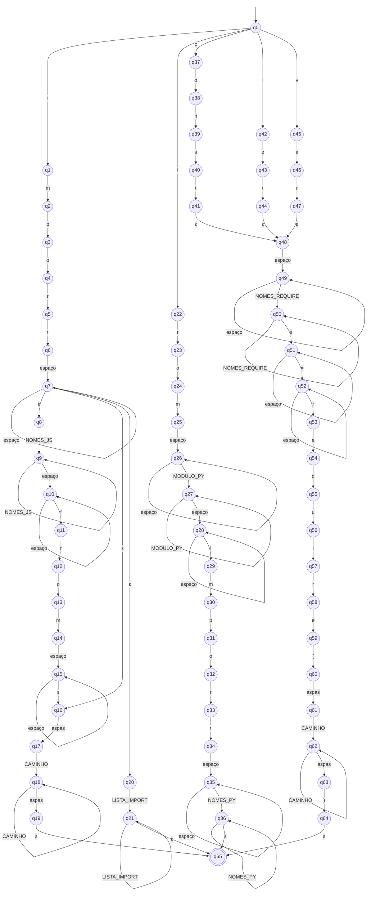

# ER-04 · Import de módulo

## Nome e finalidade

**Import de módulo.** Reconhece linhas que importam bibliotecas em JavaScript/Node.js e em Python. Em um linter, serve para mapear as **dependências** de um arquivo: quais bibliotecas ele usa e de onde vêm.

As quatro formas reconhecidas:

| Forma | Linguagem | Exemplo |
|---|---|---|
| `import … from '…'` ou `import '…'` | JavaScript (ES Modules) | `import React from 'react'` |
| `const/let/var … = require('…')` | Node.js (CommonJS) | `const fs = require('fs')` |
| `from … import …` | Python | `from os import path` |
| `import …` | Python | `import os, sys` |

## Alfabeto

Σ = letras e dígitos ASCII, `_`, os símbolos `. , * { } ( ) / - = ' "` e espaços em branco.

Para o autômato, os caracteres são agrupados em 29 colunas:

| Colunas | Símbolos | Por quê |
|---|---|---|
| 0 a 15 | `i m p o r t f c n s l e v a q u` | as letras das palavras-chave (`import`, `from`, `const`, `let`, `var`, `require`): dentro de uma palavra-chave importa **qual** letra veio |
| 16 | outra letra, dígito ou `_` | fora das palavras-chave, qualquer uma serve |
| 17 a 25 | `. , * { } ( ) / -` | cada símbolo aparece em classes diferentes da ER |
| 26 | `'` ou `"` | a ER aceita os dois tipos de aspas |
| 27 | `=` | só no `require` |
| 28 | espaço, tab, quebra de linha | o `\s` da ER |
| 29 | ε | movimento vazio |

As classes de caracteres da ER viram **conjuntos de colunas** no código, com o mesmo nome em todo lugar:

| No código | Classe na ER | Onde aparece |
|---|---|---|
| `ALFANUM` | `[a-zA-Z0-9_]` | base das outras classes |
| `CAMINHO` | `[a-zA-Z0-9_./-]` | nome do módulo entre aspas |
| `NOMES_JS` | `[a-zA-Z0-9_{}\s,*]` | o que vem entre `import` e `from` |
| `NOMES_REQUIRE` | `[a-zA-Z0-9_{}\s,]` | o que vem entre `const` e `=` |
| `MODULO_PY` | `[a-zA-Z0-9_.]` | o módulo do `from` |
| `NOMES_PY` | `[a-zA-Z0-9_,\s*()]` | o que vem depois de `from … import` |
| `LISTA_IMPORT` | `[a-zA-Z0-9_.,\s]` | o que vem depois de `import` (Python) |

## Linguagem reconhecida

Uma linha que é **inteiramente** uma das quatro formas de import. Palavras-chave separadas por pelo menos um espaço; nomes de módulos entre aspas em JavaScript; `require(…)` com os parênteses fechados.

## Expressão Regular

**Notação formal** (W = espaço, Q = aspas, e as classes da tabela acima):

```
  i·m·p·o·r·t · W·W* · (NOMES_JS·NOMES_JS* · W·W* · f·r·o·m · W·W* ∪ ε) · Q · CAMINHO·CAMINHO* · Q
∪ (c·o·n·s·t ∪ l·e·t ∪ v·a·r) · W·W* · NOMES_REQUIRE·NOMES_REQUIRE* · W* · = · W* · r·e·q·u·i·r·e · ( · Q · CAMINHO·CAMINHO* · Q · )
∪ f·r·o·m · W·W* · MODULO_PY·MODULO_PY* · W·W* · i·m·p·o·r·t · W·W* · NOMES_PY·NOMES_PY*
∪ i·m·p·o·r·t · W·W* · LISTA_IMPORT·LISTA_IMPORT*
```

**Sintaxe no código** (`src/terminal_ER/validators.py`):

```python
MODULE_IMPORT_PATTERN = (
    r"(import\s+(([a-zA-Z0-9_{}\s,*]+)\s+from\s+)?['\"][a-zA-Z0-9_./-]+['\"]"
    r"|(const|let|var)\s+[a-zA-Z0-9_{}\s,]+\s*=\s*require\(['\"][a-zA-Z0-9_./-]+['\"]\)"
    r"|from\s+[a-zA-Z0-9_.]+\s+import\s+[a-zA-Z0-9_,\s*()]+"
    r"|import\s+[a-zA-Z0-9_.,\s]+)"
)
```

## Operadores utilizados

| Operador | Na notação formal | No Python | Papel nesta ER |
|---|---|---|---|
| União | `∪` | `\|` e `[...]` | escolhe entre as 4 formas; `(const\|let\|var)` escolhe a palavra-chave; cada `[...]` é uma união de símbolos |
| Concatenação | `·` | lado a lado | cada palavra-chave é a concatenação das suas letras |
| Fecho de Kleene | `*` | `*` | `\s*`: espaços opcionais em volta do `=` |
| Fecho positivo | `x · x*` | `+` | `\s+`: pelo menos um espaço; `[...]+`: nome com pelo menos um caractere |
| Opcional | `(x ∪ ε)` | `?` | a parte `NOMES from` do import JavaScript pode faltar (`import './estilo.css'`) |
| Escape | – | `\(`, `\)`, `\"` | parênteses e aspas literais |

## AFNε

Arquivo: `src/automatos/afne_er4.py`

- **Estado inicial:** q0
- **Estados finais:** {q65}
- **Estados:** 66 (q0 a q65)

Como o alfabeto tem 29 colunas, cada linha de `funcao` é montada pela função `linha()`, que recebe pares *(conjunto de colunas, destino)* e os destinos por ε. É a mesma ideia da `gerar_transicao_sufixo()` da ER-02.



**Transições de cada estado** (→ = inicial, * = final):

| Estado | Transições |
|---|---|
| → q0 | `i` → q1; `f` → q22; `c` → q37; `l` → q42; `v` → q45 |
| q1 | `m` → q2 |
| q2 | `p` → q3 |
| q3 | `o` → q4 |
| q4 | `r` → q5 |
| q5 | `t` → q6 |
| q6 | `espaço` → q7 |
| q7 | `espaço` → q7; ε → q8; ε → q16; ε → q20 |
| q8 | `NOMES_JS` → q9 |
| q9 | `NOMES_JS` → q9; `espaço` → q10 |
| q10 | `espaço` → q10; `f` → q11 |
| q11 | `r` → q12 |
| q12 | `o` → q13 |
| q13 | `m` → q14 |
| q14 | `espaço` → q15 |
| q15 | `espaço` → q15; ε → q16 |
| q16 | `aspas` → q17 |
| q17 | `CAMINHO` → q18 |
| q18 | `CAMINHO` → q18; `aspas` → q19 |
| q19 | ε → q65 |
| q20 | `LISTA_IMPORT` → q21 |
| q21 | `LISTA_IMPORT` → q21; ε → q65 |
| q22 | `r` → q23 |
| q23 | `o` → q24 |
| q24 | `m` → q25 |
| q25 | `espaço` → q26 |
| q26 | `espaço` → q26; `MODULO_PY` → q27 |
| q27 | `MODULO_PY` → q27; `espaço` → q28 |
| q28 | `espaço` → q28; `i` → q29 |
| q29 | `m` → q30 |
| q30 | `p` → q31 |
| q31 | `o` → q32 |
| q32 | `r` → q33 |
| q33 | `t` → q34 |
| q34 | `espaço` → q35 |
| q35 | `espaço` → q35; `NOMES_PY` → q36 |
| q36 | `NOMES_PY` → q36; ε → q65 |
| q37 | `o` → q38 |
| q38 | `n` → q39 |
| q39 | `s` → q40 |
| q40 | `t` → q41 |
| q41 | ε → q48 |
| q42 | `e` → q43 |
| q43 | `t` → q44 |
| q44 | ε → q48 |
| q45 | `a` → q46 |
| q46 | `r` → q47 |
| q47 | ε → q48 |
| q48 | `espaço` → q49 |
| q49 | `espaço` → q49; `NOMES_REQUIRE` → q50 |
| q50 | `NOMES_REQUIRE` → q50; ε → q51 |
| q51 | `espaço` → q51; `=` → q52 |
| q52 | `espaço` → q52; `r` → q53 |
| q53 | `e` → q54 |
| q54 | `q` → q55 |
| q55 | `u` → q56 |
| q56 | `i` → q57 |
| q57 | `r` → q58 |
| q58 | `e` → q59 |
| q59 | `(` → q60 |
| q60 | `aspas` → q61 |
| q61 | `CAMINHO` → q62 |
| q62 | `CAMINHO` → q62; `aspas` → q63 |
| q63 | `)` → q64 |
| q64 | ε → q65 |
| *q65 | – |

### Como o autômato foi montado

| Parte | Estados | O que acontece |
|---|---|---|
| escolha do ramo | q0 | a primeira letra decide: `i` → import, `f` → from, `c`/`l`/`v` → const/let/var |
| `import` + espaços | q1 a q7 | os estados q0 a q6 são os do AFNε original, que só reconhecia a palavra `import` |
| bifurcação do import | q7 →ε q8, q16, q20 | a máquina tenta ao mesmo tempo: nomes + `from` (JS), módulo direto entre aspas (JS) ou lista de nomes (Python) |
| `NOMES from` | q8 a q15 | nomes, espaço, `from`, espaço |
| `'módulo'` | q16 a q19 | aspas, caminho, aspas |
| `import os, sys` | q20, q21 | lista de nomes Python |
| `from … import …` | q22 a q36 | `from`, módulo, `import`, nomes |
| `const/let/var` | q37 a q47 | cada palavra-chave é uma sequência de estados; as três se juntam em q48 por ε |
| `nomes = require('…')` | q48 a q64 | nomes, `=`, `require`, `(`, módulo entre aspas, `)` |
| final | q65 | todos os ramos chegam aqui por ε |

## Limitações conhecidas

- **`import React from react` (sem aspas) é aceito.** Ele não entra na forma JavaScript, mas cai na quarta forma (`import` + lista Python), já que "React from react" são só letras e espaços. A ER e o AFNε concordam, porque é uma característica da linguagem definida pela ER.
- **Aspas misturadas são aceitas** (`import x from 'react"`), porque `['\"]` é sorteado de forma independente na abertura e no fechamento.
- **Espaços nas pontas contam.** `" import math"` é rejeitado. A versão original aplicava `.strip()` antes da ER, mas isso fazia a função reconhecer uma linguagem diferente da ER e do AFNε, e o `.strip()` foi removido.

## Casos de teste

| Cadeia | Esperado | Observação |
|---|---|---|
| `"import React from 'react'"` | aceita |  |
| `"const fs = require('fs')"` | aceita |  |
| `'from os import path'` | aceita |  |
| `'import math'` | aceita |  |
| `'import { useState } from "react"'` | aceita |  |
| `"let cfg = require('./config/app-dev')"` | aceita | caso-limite: caminho com ./ / e - |
| `'import'` | rejeita |  |
| `"require('fs')"` | rejeita |  |
| `'from import path'` | rejeita |  |
| `'include <stdio.h>'` | rejeita |  |
| `"import React from 'react"` | rejeita | aspas sem fechar |
| `"const fs = require('fs'"` | rejeita | caso-limite: falta só o ')' |
| `'from os import'` | rejeita | caso-limite: import sem nomes |
| `''` | rejeita |  |
