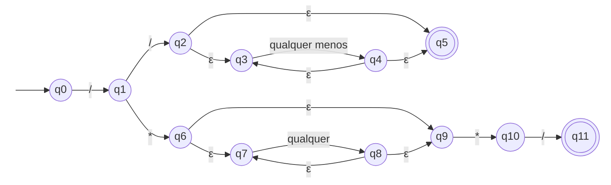

# ER-05 · Comentário

## Nome e finalidade

**Comentário de linha ou de bloco.** Reconhece comentários no estilo C/Java/JavaScript: de linha (`// ...`) e de bloco (`/* ... */`). Em um linter, serve para separar o que é comentário do que é código, por exemplo para encontrar `// TODO` pendentes ou ignorar trechos comentados na análise.

## Alfabeto

Σ = qualquer caractere. Para o autômato, os caracteres são agrupados em classes:

| Símbolo | Significado | Na `criptografia()` |
|---|---|---|
| `/` | barra | coluna 0 |
| `*` | asterisco | coluna 1 |
| `\n` | quebra de linha | coluna 2 |
| C | qualquer outro caractere | coluna 3 |
| ε | movimento vazio | coluna 4 |

A barra, o asterisco e a quebra de linha têm coluna própria porque mudam o comportamento: `/` e `*` abrem e fecham comentários, e `\n` encerra o comentário de linha.

## Linguagem reconhecida

Cadeias que são **um comentário inteiro**:

1. **De linha:** `//` seguido de qualquer coisa **sem quebra de linha**.
2. **De bloco:** `/*`, qualquer coisa (inclusive quebras de linha) e `*/` no final.

Código antes do comentário (`int x = 10; // inline`) faz a cadeia ser rejeitada, porque ela não é **só** um comentário.

## Expressão Regular

**Notação formal:**

```
/ · / · (/ ∪ * ∪ C)*   ∪   / · * · (/ ∪ * ∪ \n ∪ C)* · * · /
```

**Sintaxe no código** (`src/terminal_ER/validators.py`):

```python
COMMENT_PATTERN = r"(//.*|/\*[\s\S]*?\*/)"
```

## Operadores utilizados

| Operador | Na notação formal | No Python | Papel nesta ER |
|---|---|---|---|
| União | `∪` | `\|` | comentário de linha **ou** de bloco |
| Concatenação | `·` | lado a lado | `//` seguido do texto; `/*`, texto e `*/` |
| Fecho de Kleene | `*` | `*` e `*?` | o texto do comentário pode ter qualquer tamanho, inclusive zero |
| Qualquer caractere menos `\n` | `(/ ∪ * ∪ C)` | `.` | no Python, `.` não casa com a quebra de linha |
| Qualquer caractere | `(/ ∪ * ∪ \n ∪ C)` | `[\s\S]` | "espaço **ou** não espaço" = tudo, inclusive `\n` |
| Escape | – | `\*` | `*` sozinho é o fecho de Kleene; `\*` é o asterisco literal |

## AFNε

Arquivo: `src/automatos/afne_er5.py`

- **Estado inicial:** q0
- **Estados finais:** {q5, q11}
- **Estados:** 12 (q0 a q11)



**Tabela de transições** (→ = inicial, * = final, – = sem transição; C = outro caractere):

| Estado | `/` | `*` | `\n` | `C` | ε |
|---|---|---|---|---|---|
| → q0 | {q1} | – | – | – | – |
| q1 | {q2} | {q6} | – | – | – |
| q2 | – | – | – | – | {q3, q5} |
| q3 | {q4} | {q4} | – | {q4} | – |
| q4 | – | – | – | – | {q3, q5} |
| *q5 | – | – | – | – | – |
| q6 | – | – | – | – | {q7, q9} |
| q7 | {q8} | {q8} | {q8} | {q8} | – |
| q8 | – | – | – | – | {q7, q9} |
| q9 | – | {q10} | – | – | – |
| q10 | {q11} | – | – | – | – |
| *q11 | – | – | – | – | – |

### Como o autômato foi montado

| Pedaço da ER | Estados | O que acontece |
|---|---|---|
| `/` inicial | q0 → q1 | as duas formas começam com barra |
| `/` ou `*` | q1 → q2 ou q1 → q6 | a segunda letra decide o tipo de comentário |
| `(/ ∪ * ∪ C)*` | q2 a q5 | texto do comentário de linha: `\n` não tem transição, então a quebra mata esse ramo |
| `(… ∪ \n ∪ …)*` | q6 a q8 | texto do bloco: aceita tudo, inclusive `\n` |
| `*/` | q9 → q10 → q11 | o fechamento do bloco |

**O não determinismo em ação:** dentro de um bloco, ao ler um `*`, a máquina não sabe se é texto ou o começo do `*/`. Ela segue os dois caminhos ao mesmo tempo (q7 → q8 **e** q9 → q10). Se o próximo símbolo for `/` e a cadeia acabar ali, o caminho do fechamento chega em q11 e a cadeia é aceita.

## Limitação conhecida

`/* a */ b */` é **aceito**, tanto pela ER quanto pelo AFNε. Como `fullmatch` exige que o padrão cubra a cadeia inteira, o `[\s\S]*?` "preguiçoso" é obrigado a se esticar até o **último** `*/`, e o `*/` do meio vira parte do texto. Num compilador de verdade, o comentário terminaria no primeiro `*/`. A ER que exige isso é bem mais complexa (`/\*([^*]|\*+[^*/])*\*+/`), e ficou como possível melhoria.

## Casos de teste

| Cadeia | Esperado | Observação |
|---|---|---|
| `'// comentario simples'` | aceita |  |
| `'/* bloco curto */'` | aceita |  |
| `'/* bloco\nmultilinha */'` | aceita |  |
| `'// TODO: corrigir'` | aceita |  |
| `'//'` | aceita | caso-limite: comentário de linha vazio |
| `'/**/'` | aceita | caso-limite: bloco vazio |
| `'int x = 10; // inline'` | rejeita |  |
| `'/* sem fechar'` | rejeita |  |
| `'comentario sem barra'` | rejeita |  |
| `'*/ bloco invertido /*'` | rejeita |  |
| `'/*/'` | rejeita | caso-limite: o '*' da abertura não serve para fechar |
| `'// linha\noutra linha'` | rejeita | comentário de linha não atravessa a quebra |
| `''` | rejeita |  |
